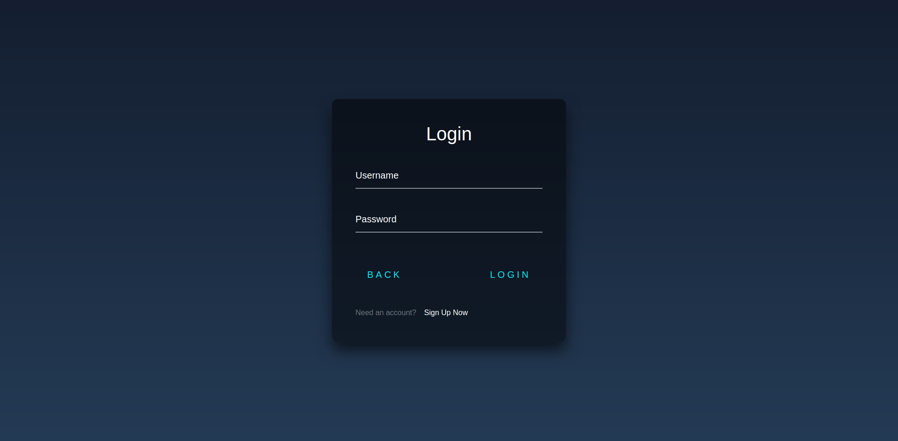
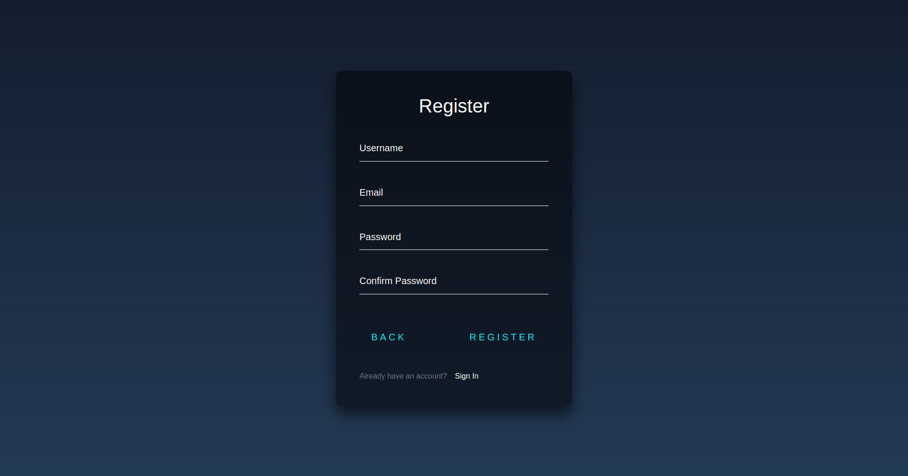
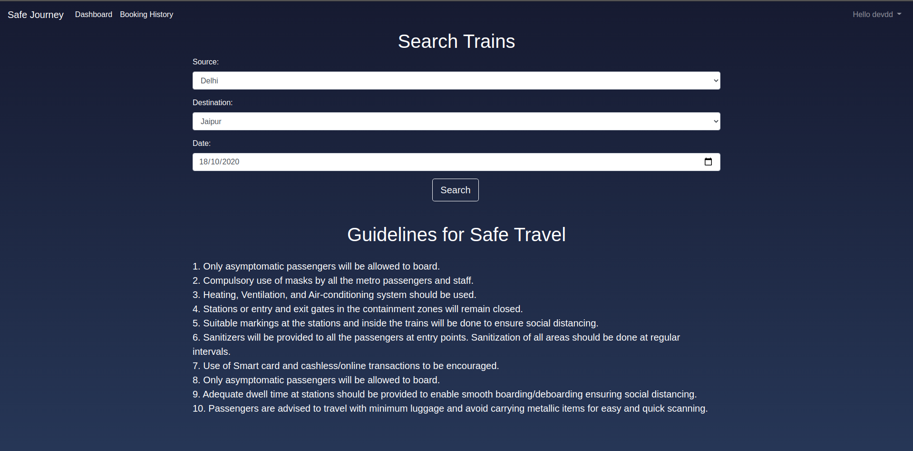
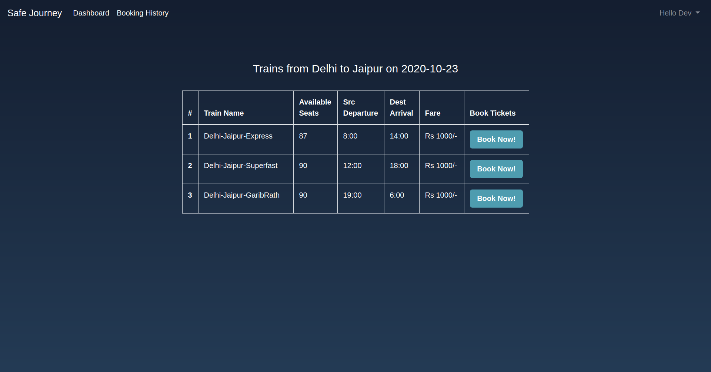
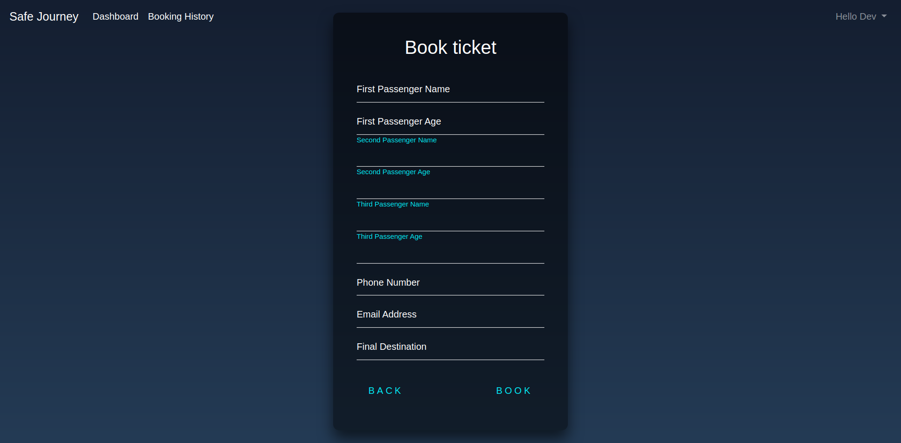
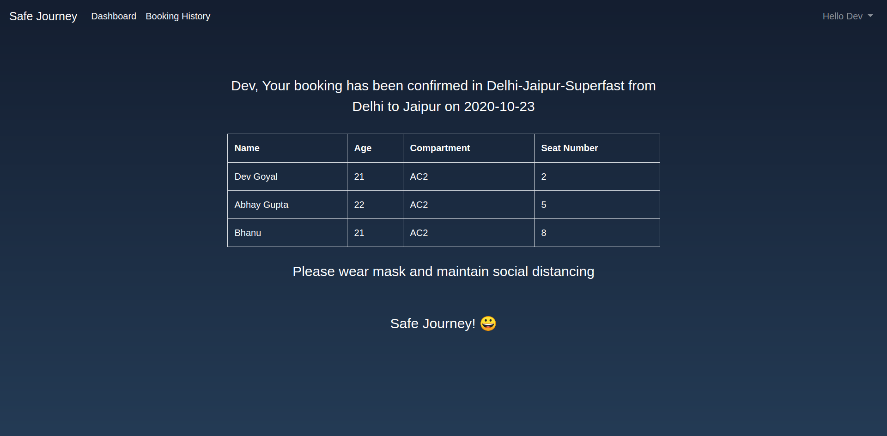
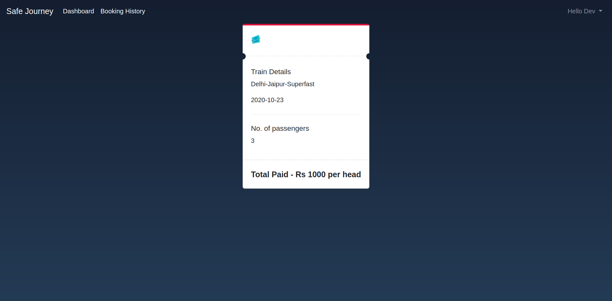

# Safe Journey
The COVID-19 cases are increasing rapidly and travel may increase the chance of getting and spreading COVID-19. It is always advised that staying home is the best way to protect yourself and others from COVID-19. But in this time people have to travel in Trains and Metro for their jobs and they may get affected by COVID-19 during their travel. They may feel well and not have any symptoms, but they can still spread COVID-19 to others. 
So, we need a safe train booking system so that only a limited person travel at a time and if a person may be found positive, then we can inform the government officials about the details of co-passengers who were travelling with the patient.

### Proposed Solution
We are proposing a Smart Ticketing Solution for trains and metros that guarantees safe travel during this pandemic by ensuring the following:

* Social Distancing is maintained by ensuring every 2 passengers have a gap of 2 seats between them.
* Reminder of COVID-19 guidelines will be shared on the ticket, website as well as in the trains.

This proposed solution also follows the government guidelines that only 33% people of the train capacity can travel.

### Tech Stack
```
- Programming Languages
    - Python 3.8
- Frameworks
    - Django 3.1.2
- Database
     - Google Firebase Firestore
- Frontend
    - HTML 5
    - CSS 3
    - Bootstrap 4
```
### Installation (for Developers)

Install the dependencies and devDependencies and start the server.

-Note: Python must be installed on your system with versions 3.0 or above. You will also need a google firebase service account which is available at https://firebase.google.com/.

To run the app locally follow the below steps : 
* Clone the repository.
```
git clone https://github.com/devgoyal04/Safe-Journey.git
```
* Run the following command -
```
pip install -r requirements.txt
```
* Make ``migrations`` to the database.
```
python3 manage.py makemigrations
python3 manage.py migrate
```
* Place the service account json file in the same directory where manage.py is present as "cred.json".

* Start the server.
```
python3 mangae.py runserver
```

### Database Structure and Schema
As Google Firebase is used as database for this app, the database is divided into documents and collections.
 Here's a hierarcy of the database:

* Booking Details
```bash
DATABASE HIRERARCY
|---trains
|--- |---users
|--- |--- |--- boarding station name
|--- |--- |--- |--- |--- Train A 
|--- |--- |--- |--- |--- |--- |--- destination station name
|--- |--- |--- |--- |--- |--- |--- |--- |--- date
|--- |--- |--- |--- |--- |--- |--- |--- |--- |--- compartment number
|--- |--- |--- |--- |--- |--- |--- |--- |--- |--- |--- |--- seat number1
|--- |--- |--- |--- |--- |--- |--- |--- |--- |--- |--- |--- seat number2
|--- |--- |--- |--- |--- |--- |--- |--- |--- |--- |--- |--- seat number3
|--- |--- |--- |--- |--- Train B
|--- |--- |--- |--- |--- |--- |--- ...
|--- |--- |--- |--- |--- Train C
|--- |--- |--- |--- |--- |--- |--- ...

```
For every seat number the Schema is defined as follows
```bash
{
    'name': "Name of the passenger",
    'age': "Age of the passenger",
    'contact': "Contact number of the passenger",
    'email' : "Email address of the passenger",
    'final_des': "Final address of the destination place",
    'userId': "Username of the booking user"
}
```
* Booking history
```
DATABASE HIRERARCY
|---history
|--- |---user id
|--- |--- |--- username1
|--- |--- |--- |--- |--- PNR1
|--- |--- |--- |--- |--- PNR2
|--- |--- |--- |--- |--- ...
|--- |--- |--- username2
|--- |--- |--- |--- ...

```
For every PNR the Schema is defined as follows
```bash
{
    'date': "Date of travel",
    'des': "Destination station",
    'src': "Boarding station",
    'total_tickets' : "No. of seats booked with same PNR",
    'train': "Name of train",
}
```
## Workflow

**Home Page**
* Home page of our website.


**Login Page**

> Login Page

**Register Page**

> Register if you are a new user

**Dashboard**
* This page contains the government guidelines regarding pandemic and allows to search trains between source city to destination city on a given date. 

> Dashboard Page View


**Available Trains**
* This page shows all the trains available along with fare, time and total available seats. 

> Avaiable tickets view

**Booking Details**
* This page contains form to be filled by user for booking tickets.

> Booking details view

**View booked ticket**
* After successful booking of ticket, user will view the booked ticket.

> View booked ticket

**Booking History**
* All tickets booked by user will be shown.

> Booking History Page View
